# Testing Documentation

## Overview

The Mexicano Tournament Manager PWA uses [Playwright](https://playwright.dev/) for end-to-end testing. Tests run against a mobile Chrome viewport (390×844) to validate the mobile-first experience.

## Setup

```bash
npm install
npx playwright install chromium
```

## Running Tests

```bash
# Run all tests
npx playwright test

# Run a specific test file
npx playwright test tests/e2e/tournament.spec.js

# Run with headed browser (visible)
npx playwright test --headed

# Run with UI mode
npx playwright test --ui
```

## Configuration

Test configuration is in `playwright.config.js`:

- **Browser**: Chromium (Mobile Chrome emulation)
- **Viewport**: 390 × 844 (iPhone 14 Pro)
- **Screenshots**: Captured on every test (on/off configurable)
- **Dev server**: Auto-started on port 3000 via `npx serve . -p 3000 -s`

## Test Suites

### 1. Settings Page (`tests/e2e/settings.spec.js`) — 7 tests

Covers the Settings page where users manage members, themes, and data.

| Test | Description |
|------|-------------|
| Navigate to settings page via bottom nav | Verifies bottom nav "Settings" link navigates correctly |
| Add members to the list | Adds multiple members and verifies they appear in the list |
| Reject duplicate member | Ensures duplicate names show a toast warning |
| Remove a member | Deletes a member and confirms removal from the list |
| Select current user from dropdown | Sets active user and verifies persistence |
| Export data initiates download | Clicks export and validates a download is triggered |
| Theme toggle changes data-theme attribute | Toggles dark mode and checks `data-theme` attribute |

**Screenshots:**

| Members List | Dark Theme |
|:---:|:---:|
| 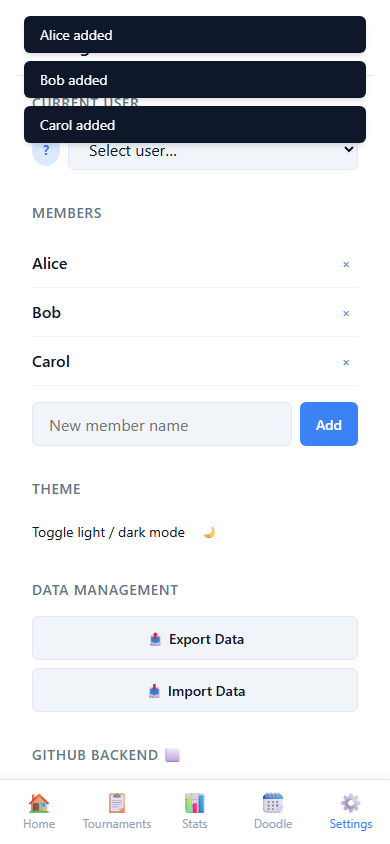 | 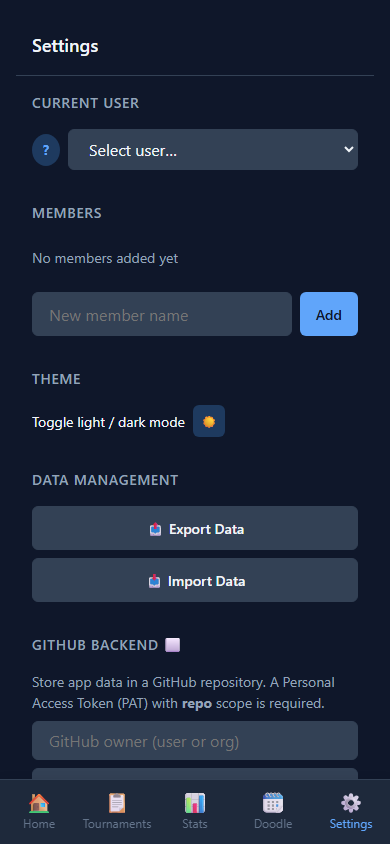 |

---

### 2. Tournament Flow (`tests/e2e/tournament.spec.js`) — 3 tests

Covers the full tournament lifecycle from creation to completion.

| Test | Description |
|------|-------------|
| Full tournament lifecycle | Creates a 4-player tournament, scores Round 1, advances to Round 2, completes the tournament |
| Create tournament page validation | Verifies that empty player names trigger validation errors |
| Start button disabled until player count selected | Checks the Start button is properly disabled/enabled |

**Screenshots:**

| Create Tournament | Round 1 Matches | Score Input | Completed |
|:---:|:---:|:---:|:---:|
| 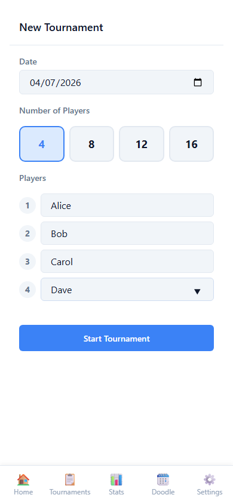 | 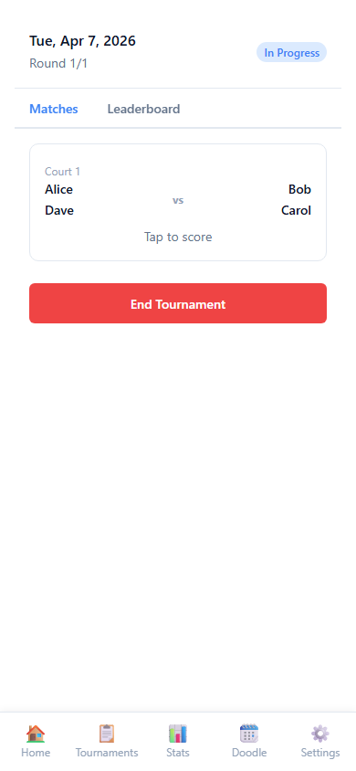 | 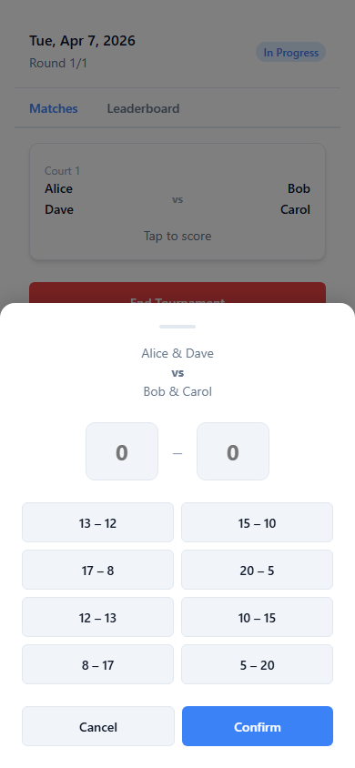 | 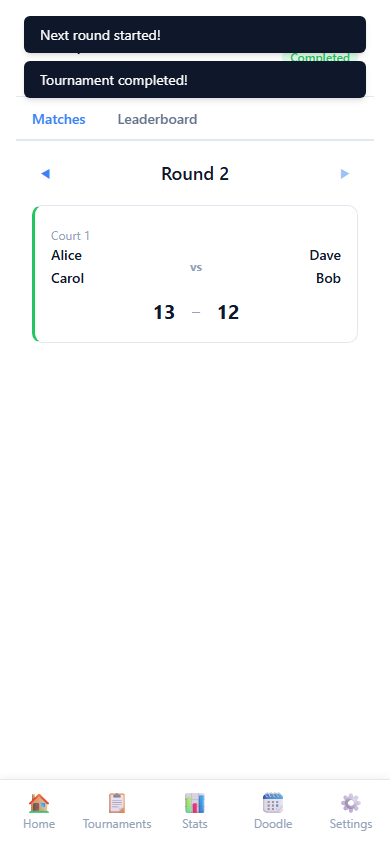 |

---

### 3. Statistics Page (`tests/e2e/statistics.spec.js`) — 4 tests

Covers the statistics tables, filters, and player profile dialog.

| Test | Description |
|------|-------------|
| Statistics table renders with player names | Seeds match data and verifies player rows appear |
| Statistics show correct data | Validates computed stats (points, wins, losses, win rate) |
| Filter chips work | Toggles between All-Time and per-tournament filters |
| Click player name opens profile dialog | Taps a player name and verifies the profile dialog opens |

**Screenshots:**

| Statistics Table | Player Profile |
|:---:|:---:|
| 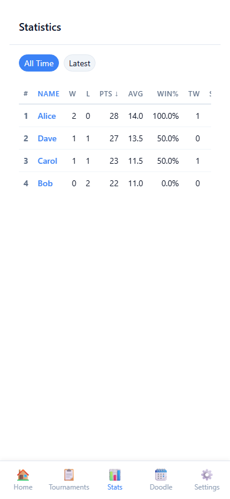 | 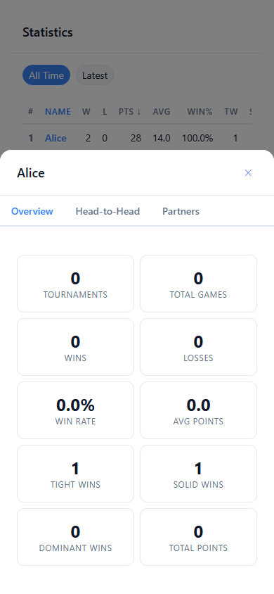 |

---

### 4. ELO Leaderboard & Charts (`tests/e2e/elo.spec.js`) — 5 tests

Covers the home page ELO leaderboard and the ELO charts page.

| Test | Description |
|------|-------------|
| Home page shows ELO leaderboard with players | Seeds data and verifies leaderboard ranks appear |
| Home page quick stats are populated | Checks the quick stats cards show correct values |
| ELO charts page renders correctly | Navigates to charts and verifies canvas + tabs render |
| ELO charts tab switching works | Switches between All-Time and Latest Tournament tabs |
| Home page links to statistics and ELO charts | Verifies navigation links from the home page |

**Screenshots:**

| ELO Leaderboard | ELO Charts |
|:---:|:---:|
| 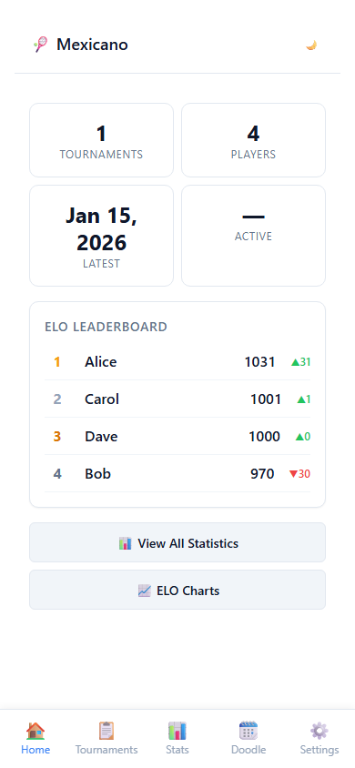 | 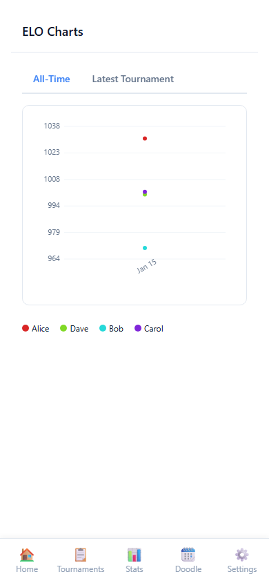 |

---

### 5. Doodle Page (`tests/e2e/doodle.spec.js`) — 5 tests (+ 1 conditional)

Covers the Doodle scheduling calendar matrix.

| Test | Description |
|------|-------------|
| Navigate to doodle page via bottom nav | Verifies bottom nav "Doodle" link works |
| Doodle matrix renders with dates | Sets a user and verifies the calendar matrix appears with date columns |
| Click cell in own row triggers interaction | Taps a date cell and verifies the toggle behavior |
| Month navigation works | Uses prev/next buttons and verifies the month label changes |
| Shows empty state when no user is selected | Clears current user and verifies the empty state message |
| Other player rows are readonly | Verifies cells for other players have the `readonly` class |

**Screenshots:**

| Doodle Calendar |
|:---:|
| 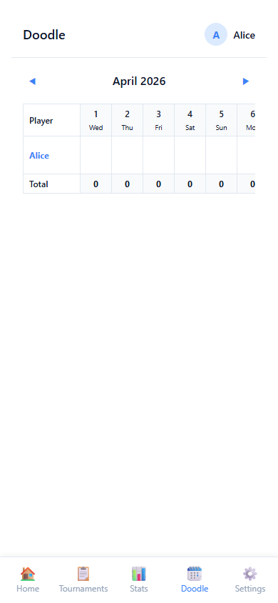 |

---

## Screenshot Directory

All screenshots are saved to `tests/screenshots/`. Two types exist:

1. **Named screenshots** — manually captured at key UI moments (e.g., `tournament-round1.png`)
2. **Auto-captured screenshots** — Playwright captures a screenshot at the end of each test in a folder named after the test

## Test Results Summary

```
Running 25 tests using 5 workers
  25 passed
```

| Suite | Tests | Status |
|-------|-------|--------|
| Settings | 7 | ✅ All pass |
| Tournament | 3 | ✅ All pass |
| Statistics | 4 | ✅ All pass |
| ELO | 5 | ✅ All pass |
| Doodle | 5 (+1) | ✅ All pass |
| **Total** | **25** | **✅ All pass** |
