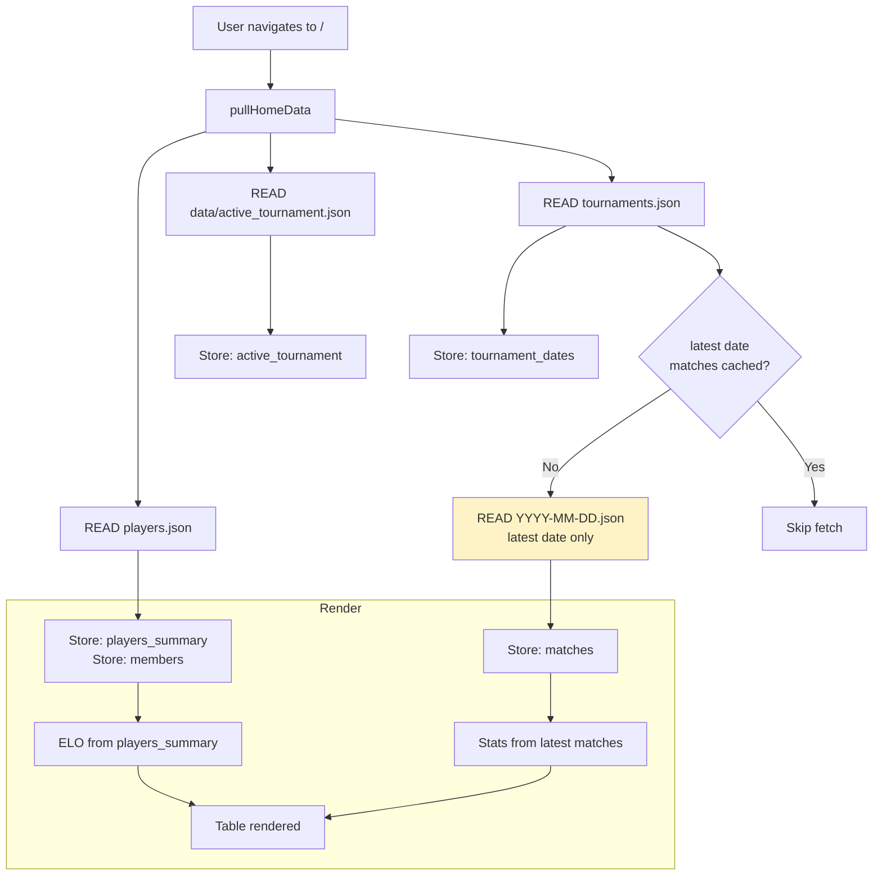
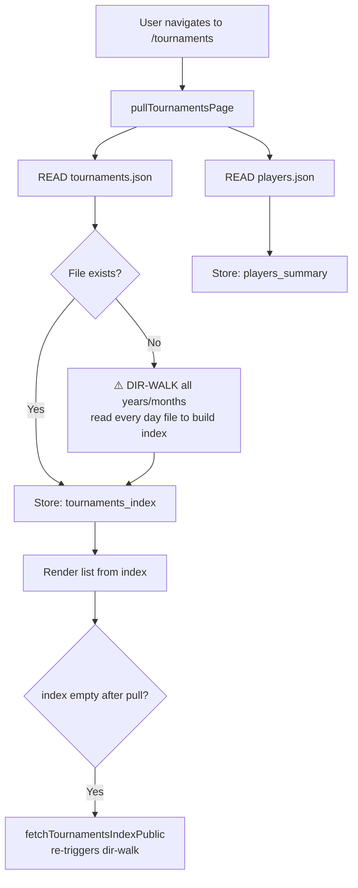
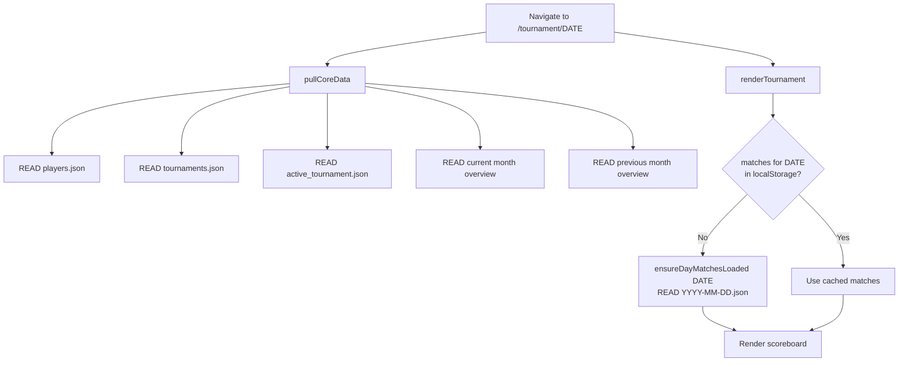
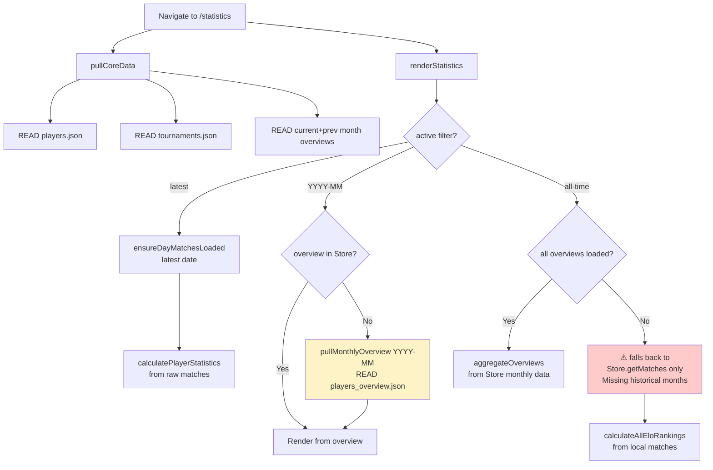
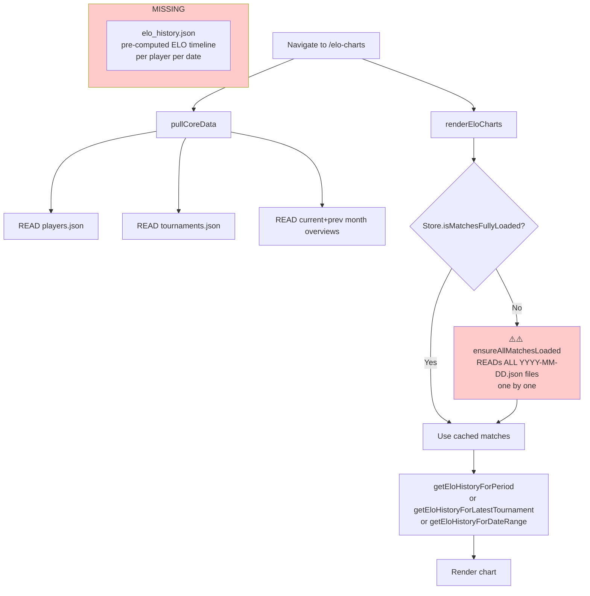
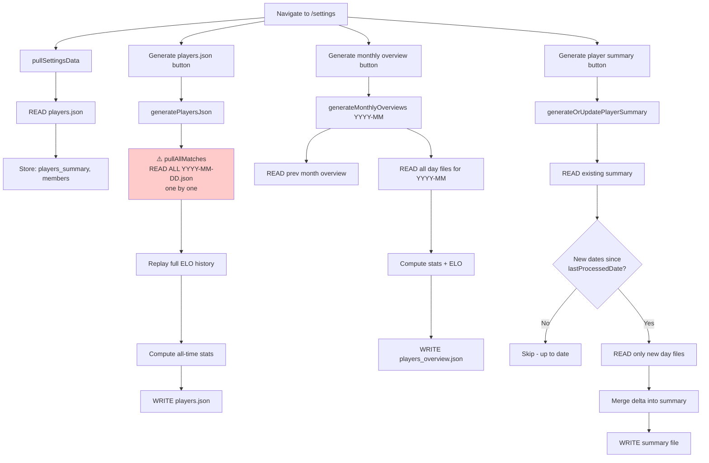
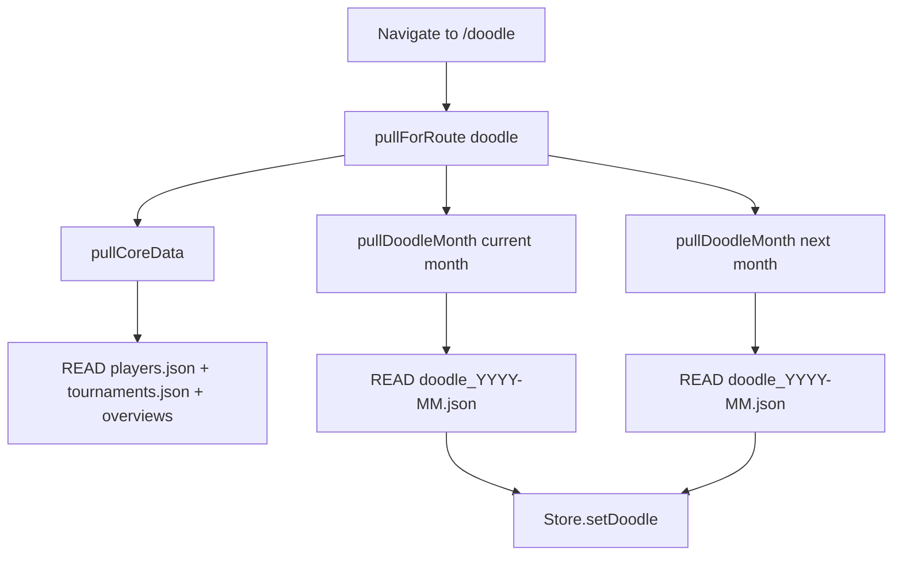
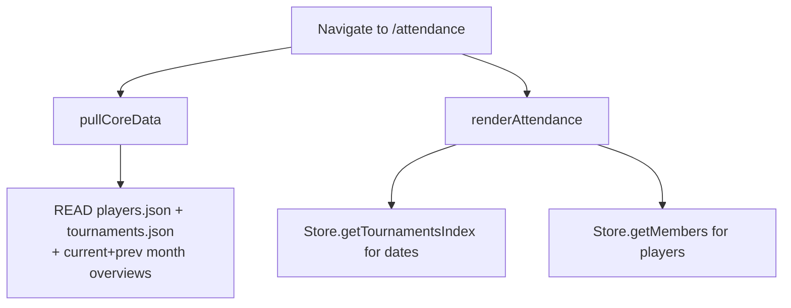
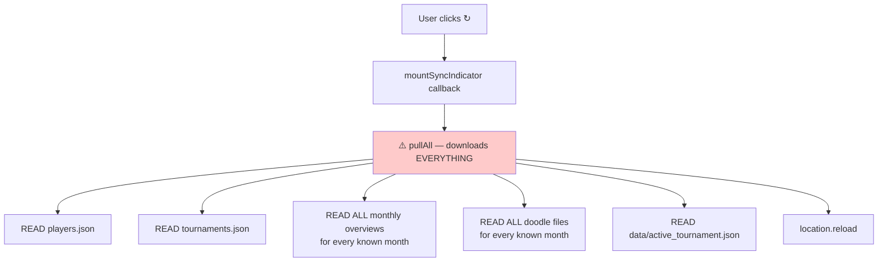

# Data Flow Documentation

> Each page: what it fetches, what it has, what is missing.

---

## Remote files (GitHub repo)

| File | Purpose | Generated by |
|------|---------|-------------|
| `players.json` | All-time stats + current ELO | `generatePlayersJson()` (Settings) |
| `tournaments.json` | Index of all tournament dates + metadata | Auto-created on first dir-walk |
| `YYYY/YYYY-MM/players_overview.json` | Per-month stats + ELO | `generateMonthlyOverviews()` (Settings) |
| `YYYY/YYYY-MM/YYYY-MM-DD.json` | Raw match records | Saved during tournament |
| `players_summaries/summary_<name>.json` | Per-player historical stats | `generateOrUpdatePlayerSummary()` (Settings) |
| `data/active_tournament.json` | Live tournament state | Auto-synced |
| `YYYY/YYYY-MM/doodle_YYYY-MM.json` | Availability / doodle entries | Auto-synced |
| ~~`elo_history.json`~~ | **MISSING** — pre-computed ELO timeline | Would be generated alongside players.json |

---

## Page-by-page flows

### 🏠 Home (`/`)

**Has:** Latest tournament stats, ELO from players.json  
**Missing:** Nothing critical (1 day file fetch max)  
**Session TTL:** 5 min — subsequent navigations skip all fetches

---

### 🏆 Tournaments (`/tournaments`)

**Has:** tournament list with metadata (playerCount, roundCount etc.)  
**Missing:** Nothing after tournaments.json exists — dir-walk is one-time  
**Session TTL:** 5 min

---

### 📋 Tournament detail (`/tournament/:date`)

**Has:** full day matches (1 file), ELO context  
**Missing:** Nothing — 1 day file is optimal  
**Session TTL:** 5 min for core; individual day always uses cache

---

### 📊 Statistics (`/statistics`)

**Has:** latest + any month with overview loaded, partial all-time via aggregation  
**Missing:**
- All-time view doesn't trigger `pullAllOverviews()` — silently shows incomplete data if monthly overviews not all in localStorage
- ELO in all-time view computed from raw matches (expensive if loaded) or skipped
**Session TTL:** 5 min for core; per-month TTL for individual overviews

---

### 📈 ELO Charts (`/elo-charts`)

**Has:** full ELO chart after loading all match files  
**⚠️ CRITICAL MISSING:** No pre-computed ELO history file. Every visit downloads **all** individual day files (N HTTP calls). With 50+ tournaments = 50+ fetches.  
**Fix needed:** Generate `elo_history.json` alongside `players.json`. Single file fetch gives complete chart data.

---

### ⚙️ Settings (`/settings`)

**Has:** lightweight settings load (players.json only)  
**⚠️ MISSING for Generate players.json:**
- Downloads ALL match files every time — even if only 1 new tournament since last run
- Should use `tournaments.json` to detect new dates, load only those, merge into existing `players.json`

**Generate monthly overview:** Efficient — only reads that month's files ✓  
**Generate player summary:** Efficient — incremental via `lastProcessedDate` ✓

---

### 🗓️ Doodle (`/doodle`)

**Has:** doodle data for current + next month  
**Missing:** Nothing — focused fetch ✓

---

### 📅 Attendance (`/attendance`)

**Has:** tournament dates, member list  
**Missing:** Nothing critical

---

## 🔄 Refresh button (sync indicator — top right `↻`)

**⚠️ CRITICAL MISSING:** Refresh button ignores current page context.  
- On home: should only fetch players.json + latest matches  
- On ELO charts: should fetch players.json + elo_history.json  
- On statistics/month view: should fetch that month's overview  
- No progress dialog shown to user  
**Fix needed:** Per-page refresh function + progress dialog

---

## Summary: What Is Missing

| Gap | Impact | Fix |
|-----|--------|-----|
| `elo_history.json` not generated | ELO Charts downloads ALL match files (N fetches) | Add `generateEloHistory()` that writes pre-computed snapshots; read in ELO charts page |
| Refresh button not page-aware | Always does full `pullAll()` — expensive | Route-aware refresh with progress modal |
| `generatePlayersJson` not incremental | Downloads ALL match files even if 1 new tournament | Use `tournaments.json` + `players.json` as base; only fetch new dates |
| Statistics all-time doesn't trigger `pullAllOverviews` | Shows incomplete data silently | Call `pullAllOverviews()` when all-time filter selected |
| Progress dialog missing from refresh | User sees no feedback during sync | Modal dialog with per-step progress |
| `pullCoreData` not aware of `/elo-charts` | Falls back to downloading all matches | Add `pullEloChartsData()` that reads `elo_history.json` |
