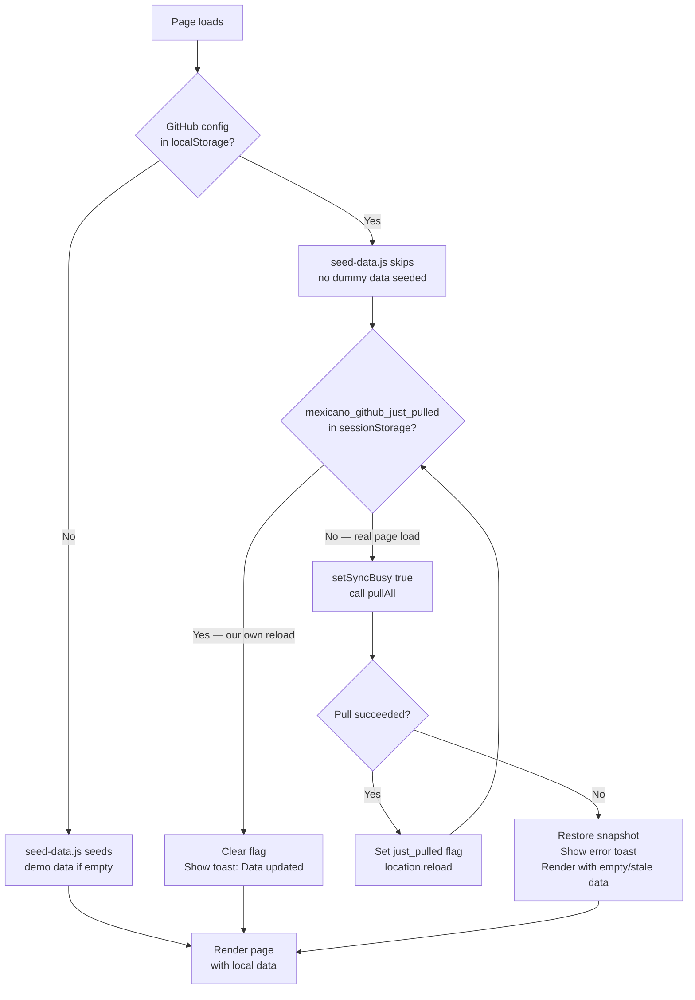
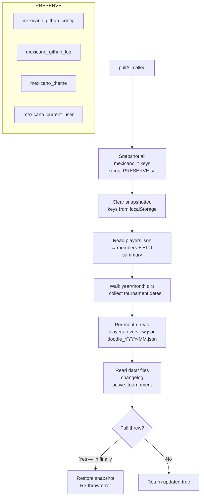
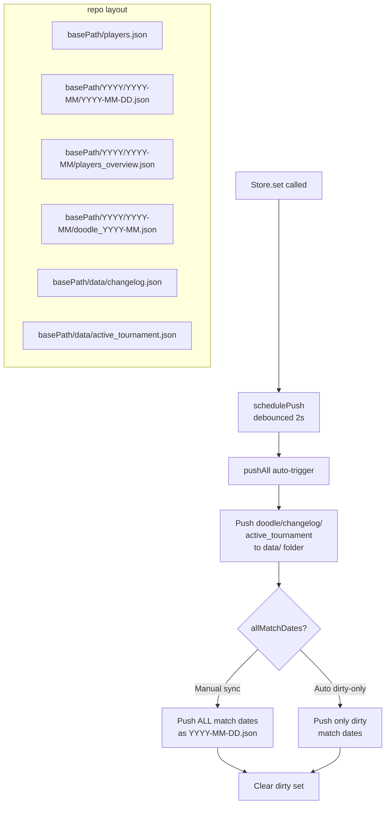

# Sync Architecture

Documents the GitHub sync flows, localStorage schema, and data lifecycle for the Mexicano app.

---

## Page Load Flow



---

## GitHub Pull Flow (`pullAll`)



**What pull writes to localStorage:**

| Step | Key written | Source |
|------|-------------|--------|
| 1 | `mexicano_members` | `players.json` → player names sorted |
| 1 | `mexicano_players_summary` | `players.json` → ELO data |
| 2 | `mexicano_tournament_dates` | Directory walk → all `YYYY-MM-DD.json` files |
| 3 | `mexicano_monthly_YYYY-MM` | `players_overview.json` per month |
| 3 | `mexicano_doodle_YYYY-MM` | `doodle_YYYY-MM.json` per month |
| 4 | `mexicano_changelog` | `data/changelog.json` |
| 4 | `mexicano_active_tournament` | `data/active_tournament.json` |

**What pull does NOT write:** `mexicano_matches` — matches are loaded lazily per tournament day via `ensureDayMatchesLoaded(date)` when the user navigates to a tournament page.

---

## GitHub Push Flow (`pushAll`)



**Note:** `players.json` and `players_overview.json` are written by external Python scripts, not by this app. The app is read-only for those files.

---

## localStorage Key Reference

| Key | What is stored | Set when | Cleared when | Notes |
|-----|---------------|----------|--------------|-------|
| `mexicano_github_config` | `{owner, repo, pat, basePath}` | User saves Settings | User clicks Clear | Never cleared by pull |
| `mexicano_github_log` | Array of API operation log entries | Every GitHub API call | Never auto-cleared | Max 200 entries |
| `mexicano_theme` | `'light'` or `'dark'` | Theme toggle | Never | User preference, survives pull |
| `mexicano_current_user` | Player name string | User picks themselves in Settings | Never | User preference, survives pull |
| `mexicano_members` | `string[]` sorted player names | `pullAll` (from `players.json`) | Start of `pullAll` | Empty if no `players.json` in repo |
| `mexicano_players_summary` | `{name, elo, previousElo}[]` | `pullAll` (from `players.json`) | Start of `pullAll` | ELO leaderboard source |
| `mexicano_tournament_dates` | `'YYYY-MM-DD'[]` sorted | `pullAll` (directory walk) | Start of `pullAll` | Tournament list source |
| `mexicano_monthly_YYYY-MM` | `{name, totalPoints, wins, …}[]` | `pullAll` per month | Start of `pullAll` | Monthly stats |
| `mexicano_doodle_YYYY-MM` | `{name, selectedDates[]}[]` | `pullAll` + `Store.setDoodle` | Start of `pullAll` | Attendance schedule |
| `mexicano_matches` | `Match[]` all loaded match objects | Lazy load per tournament day | Start of `pullAll` | Populated on-demand, never by pull directly |
| `mexicano_matches_fully_loaded` | `true` | After bulk local data load | Start of `pullAll` | Flag for local dev server only |
| `mexicano_changelog` | `{playerName, year, month, …}[]` | `pullAll` + `Store.setChangelog` | Start of `pullAll` | Doodle change history |
| `mexicano_active_tournament` | Tournament object | `Store.setActiveTournament` | `Store.clearActiveTournament` + start of `pullAll` | In-progress tournament |
| `mexicano_local_data_loaded` | `'true'` | Dev server local data load | Never | Dev-only, prevents double-loading |

### Preserved across `pullAll`

These keys are **never touched** by `pullAll` (neither cleared nor overwritten):

- `mexicano_github_config` — config must survive to make the API calls
- `mexicano_github_log` — audit trail
- `mexicano_theme` — user display preference
- `mexicano_current_user` — who you are
- `mexicano_local_data_loaded` — dev-server one-shot flag; if cleared, `loadLocalData()` re-runs and triggers a reload loop

---

## Repo Directory Structure

```
<basePath>/
├── players.json                          ← ELO + member list (Python-generated)
├── YYYY/
│   └── YYYY-MM/
│       ├── YYYY-MM-DD.json               ← Per-tournament match backup
│       ├── players_overview.json         ← Monthly stats (Python-generated)
│       └── doodle_YYYY-MM.json           ← Attendance schedule
└── data/
    ├── changelog.json
    └── active_tournament.json
```

**Hardcoded values:**
- `owner`: `MinoPlay`
- `repo`: `DataHub`
- `basePath`: `mexicano_v3/backup-data`
