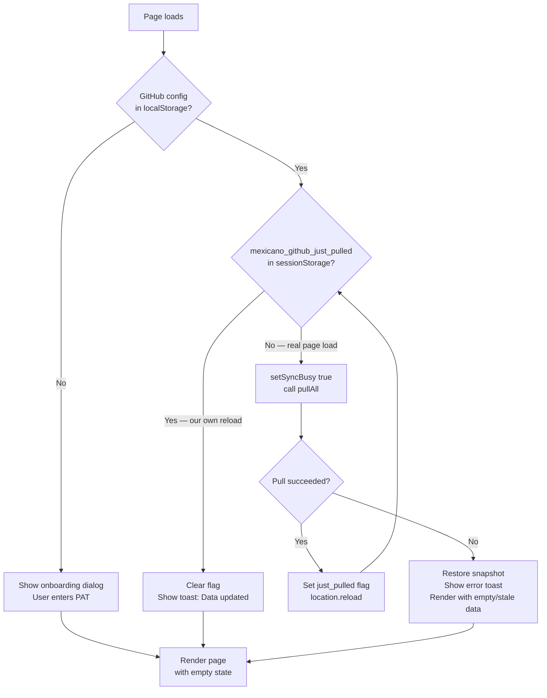
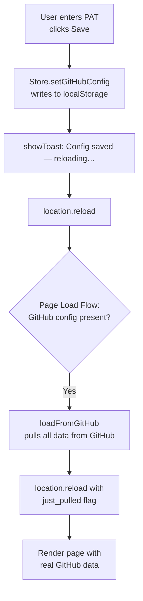
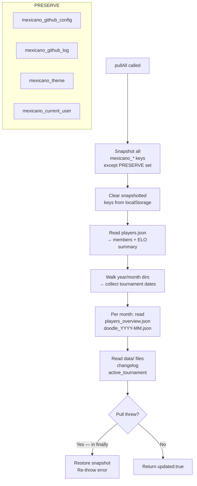
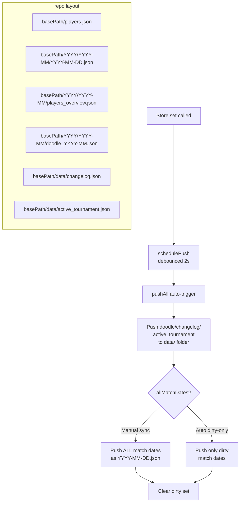

# Sync Architecture

Documents the GitHub sync flows, client storage model, and data lifecycle for the Mexicano app.

> **Current state:** Supabase is the source of truth. The GitHub flows below are
> retained for historical context; see **Client Storage Model** for what the
> browser actually persists today.

---

## Page Load Flow


```mermaid
flowchart TD
    A[Page loads] --> B{GitHub config\nin localStorage?}
    B -->|No| C[Show onboarding dialog\nUser enters PAT]
    C --> D[Render page\nwith empty state]
    B -->|Yes| E{mexicano_github_just_pulled\nin sessionStorage?}
    E -->|Yes — our own reload| G[Clear flag\nShow toast: Data updated]
    G --> D
    E -->|No — real page load| H[setSyncBusy true\ncall pullAll]
    H --> I{Pull succeeded?}
    I -->|Yes| J[Set just_pulled flag\nlocation.reload]
    J --> E
    I -->|No| K[Restore snapshot\nShow error toast\nRender with empty/stale data]
    K --> D
```

---

## PAT First Save Flow

When the user enters a PAT and clicks **Save** in Settings for the first time (or updates the PAT):


```mermaid
flowchart TD
    A[User enters PAT\nclicks Save] --> B[Store.setGitHubConfig\nwrites to localStorage]
    B --> C[showToast: Config saved — reloading…]
    C --> D[location.reload]
    D --> E{Page Load Flow:\nGitHub config present?}
    E -->|Yes| F[loadFromGitHub\npulls all data from GitHub]
    F --> G[location.reload with\njust_pulled flag]
    G --> H[Render page with\nreal GitHub data]
```

**Cross-tab behaviour:** When the PAT is saved in one browser tab, all other open tabs detect the `storage` event on `mexicano_github_config` and call `loadFromGitHub()` automatically — no manual refresh required in any tab.

---



```mermaid
flowchart TD
    A[pullAll called] --> B[Snapshot all\nmexicano_* keys\nexcept PRESERVE set]
    B --> C[Clear snapshotted\nkeys from localStorage]
    C --> D[Read players.json\n→ members + ELO summary]
    D --> E[Walk year/month dirs\n→ collect tournament dates]
    E --> F[Per month: read\nplayers_overview.json\ndoodle_YYYY-MM.json]
    F --> G[Read data/ files\nchangelog\nactive_tournament]
    G --> H{Pull threw?}
    H -->|Yes — in finally| I[Restore snapshot\nRe-throw error]
    H -->|No| J[Return updated:true]

    subgraph PRESERVE
        P1[mexicano_github_config]
        P2[mexicano_github_log]
        P3[mexicano_theme]
        P4[mexicano_current_user]
    end
```

**What pull writes to localStorage:**

| Step | Key written | Source |
|------|-------------|--------|
| 1 | `mexicano_members` | `players.json` → player names sorted |
| 1 | `mexicano_players_summary` | `players.json` → ELO data |
| 2 | `mexicano_tournament_dates` | Directory walk → all `YYYY-MM-DD.json` files |
| 3 | `mexicano_monthly_YYYY-MM` | `players_overview.json` per month |
| 3 | `mexicano_doodle_YYYY-MM` | `doodle_YYYY-MM.json` per month |
| 4 | `mexicano_changelog` | `data/changelog.json` |
| 4 | `mexicano_active_tournament` | `data/active_tournament.json` |

**What pull does NOT write:** `mexicano_matches` — matches are loaded lazily per tournament day via `ensureDayMatchesLoaded(date)` when the user navigates to a tournament page.

---

## GitHub Push Flow (`pushAll`)


```mermaid
flowchart TD
    A[Store.set called] --> B[schedulePush\ndebounced 2s]
    B --> C[pushAll auto-trigger]
    C --> D[Push doodle/changelog/\nactive_tournament\nto data/ folder]
    D --> E{allMatchDates?}
    E -->|Manual sync| F[Push ALL match dates\nas YYYY-MM-DD.json]
    E -->|Auto dirty-only| G[Push only dirty\nmatch dates]
    F --> H[Clear dirty set]
    G --> H

    subgraph repo layout
        R1[basePath/players.json]
        R2[basePath/YYYY/YYYY-MM/YYYY-MM-DD.json]
        R3[basePath/YYYY/YYYY-MM/players_overview.json]
        R4[basePath/YYYY/YYYY-MM/doodle_YYYY-MM.json]
        R5[basePath/data/changelog.json]
        R6[basePath/data/active_tournament.json]
    end
```

**Note:** `players.json` and `players_overview.json` are written by external Python scripts, not by this app. The app is read-only for those files.

---

## Client Storage Model

Supabase is the source of truth. The browser therefore persists **only** state
that Supabase does not own, and keeps everything else in the ephemeral
in-memory `Cache` (`js/cache.js`), which is wiped on every page load and
re-hydrated from Supabase by `pullForRoute()`.

### What is persisted in `localStorage`

Exactly three categories. `Store.set()` enforces this with an allowlist in
`js/store.js` and logs a warning for anything else.

**1. Backend configuration and authentication state**

| Key | What is stored |
|-----|---------------|
| `mexicano_supabase_config` | `{url, anonKey}` |
| `mexicano_supabase_session` | Supabase auth session (access/refresh token) |
| `mexicano_access_role` | `'admin'` or `'member'` |
| `mexicano_access_expires_at` | Access grant expiry |
| `mexicano_current_player_id` | Selected player identity for this device |
| `mexicano_github_config` | `{owner, repo, pat}` — legacy backend config |

**2. User and device preferences**

| Key | What is stored |
|-----|---------------|
| `mexicano_current_user` | Player name chosen in Settings |
| `mexicano_device_type` | `'android'` or `'iphone'` (top padding) |
| `mexicano_logs_enabled` | Logs tab toggle |
| `mexicano_theme` | `'light'` or `'dark'` |
| `mexicano_round_log` | Admin diagnostics ring buffer (max 200 entries) |

**3. Page-specific preferences**

Written directly by the page modules and intentionally unprefixed:
`stats_active_filter`, `stats_active_tab`, `stats_attendance_filter`,
`stats-attendance-prefs`, `elo-charts-prefs`.

### What is held in memory only

All Supabase-owned data: `matches`, `matches_fully_loaded`, `members`,
`players_summary`, `tournaments_index`, `tournament_dates`, `active_tournament`,
`elo_baseline`, `doodle_<YYYY-MM>`, `doodle_changelog_<YYYY-MM>`,
`attendance_manual`, `monthly_<YYYY-MM>`, `monthly_raw_<YYYY-MM>`,
`elo_history_player_<id>`, plus the `supabase_*_loaded` pull guards.

Because none of this survives a refresh, the UI can never show a stale local
copy of backend state, and every tournament mutation is written straight
through to Supabase (`persistTournamentState` in `js/services/tournament.js`)
rather than being buffered on the device.

### Migration

`Store.purgeNonPersistedKeys()` runs once at startup (`js/app.js`) and removes
any `mexicano_*` key outside the allowlist, so devices upgrading from the build
that persisted domain data cannot shadow live Supabase state.

### Preview deployments

`installStorageNamespace()` (`js/deploy-env.js`) transparently prefixes every
key with `preview-<slug>:` on preview deploys, so the table above describes the
main deploy's unprefixed names.

---

## Repo Directory Structure

```
<basePath>/
├── players.json                          ← ELO + member list (Python-generated)
├── YYYY/
│   └── YYYY-MM/
│       ├── YYYY-MM-DD.json               ← Per-tournament match backup
│       ├── players_overview.json         ← Monthly stats (Python-generated)
│       └── doodle_YYYY-MM.json           ← Attendance schedule
└── data/
    ├── changelog.json
    └── active_tournament.json
```

**Hardcoded values:**
- `owner`: `MinoPlay`
- `repo`: `DataHub_Mexicano`
- `basePath`: `mexicano_v3/backup-data`
